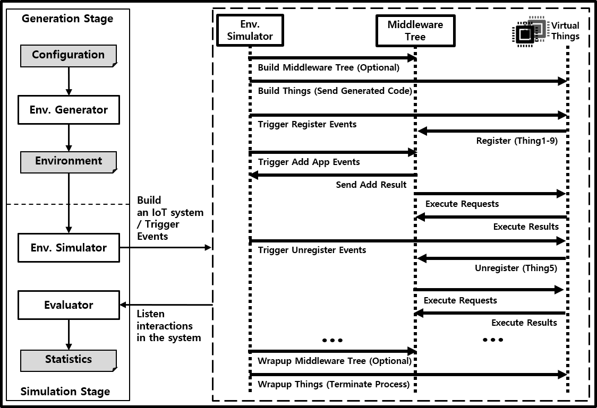

# Simulation Framework for Hierarchical Edge-based IoT

<div style="text-align:center">
  <figure>
    
    <figcaption> 프레임워크 구조 </figcaption>
  </figure>
</div>

이 프레임워크는 MySSIX IoT 환경을 시뮬레이션하는 것을 목적으로 합니다.
사용자는 이 프레임워크를 통해 다음과 같은 기능을 사용할 수 있습니다.

#### 1. 목표하는 IoT 시스템을 다양한 규모에 따라 미리 구현

사용자는 본 프레임워크를 사용하여 자신이 목표로 하는 IoT 환경을 쉽게 설정하여 구축해볼 수 있습니다. \
이 때 실제 하드웨어를 기반으로 시스템을 구축할 수 있기 때문에 정확한 결과를 가늠할 수 있습니다.

#### 2. **스케줄링 알고리즘**을 평가

사용자는 본 프레임워크를 사용하여 자신만의 **스케줄링 알고리즘**을 구현하고 MySSIX IoT 시스템을 시뮬레이션 할 수 있습니다. \
다양한 IoT 환경과 **스케줄링 알고리즘**을 사용하여 시뮬레이션을 실행하고, 시뮬레이션 결과를 기반으로 통계를 제공합니다. \
사용자는 이를 통해 최적의 **스케줄링 알고리즘** 선택합니다.

본 프레임워크 설명에 사용되는 **용어**에 대해서는 [**용어**](docs/terminology.md)를 참고해주세요.

<!-- [](LICENSE) -->

## 빠른 시작

### 의존성

이 프레임워크는 다음의 의존성을 요구합니다.

- Ubuntu 20.04 버전 이상
- Git
- Python 3.7 버전 이상
- C/C++ 빌드 환경

다음 명령어를 통해 의존성을 설치할 수 있습니다.

```bash
sudo apt update
sudo apt upgrade -y
sudo apt install git python3 python3-pip openssh-server build-essential -y
```

### 설치

먼저, 다음 명령어를 통해 레포지토리를 클론합니다.

```bash
git clone https://github.com/sopiot/simulation-framework.git
```

그리고, 다음 명령어로 `simulation-framework` 파이썬 패키지를 설치합니다.

```bash
cd simulation-framework
pip3 install .
```

### 기본 사용법

#### 로컬 디바이스에서 간단한 시뮬레이션 실행하기

```bash
cd sim_env_samples
python3 run.py -c ../sim_env_samples/simple_home_local -po ../scheduling_algorithm/samples
```

처음 시뮬레이션을 실행할 경우, `localhost`의 비밀번호를 입력합니다.

#### 원격 디바이스들에서 시뮬레이션 실행하기

시뮬레이션을 실행할 때 **Middleware**와 **Thing**을 로컬 디바이스 대신 원격 디바이스에 분산하여 실행할 수 있습니다. \
원격 디바이스 정보를 **시뮬레이션 환경 파일**의 `device_pool_path`에 지정된 **디바이스 풀 파일**에 명세하여야 합니다.

```bash
vi device_pool.yml

# 아래의 형식대로 디바이스 정보 입력
# ...
# middlerware_1:          # 디바이스 이름
#   host: 192.168.0.56
#   password: PaSsW0rd
#   ssh_port: 22
#   mqtt_port: 1883
#   user: test_user
# ...
```

```bash
cd sim_env_samples
python3 run.py -c ../sim_env_samples/simple_home_local -po ../scheduling_algorithm/samples
```

자세한 사항은 [**디바이스 풀 파일**](docs/config_files.md#디바이스-풀-파일)을 참고하시기 바랍니다.

**시뮬레이션 환경 파일**의 `middleware`와 `thing`섹션에 `device`옵션을 추가함으로써 어떤 원격 디바이스를 사용할지 명세할 수 있습니다. `device`옵션은 **디바이스 풀 파일**에 명세된 디바이스의 이름의 리스트(`[device1, device2, ...]`)로 명세되어지며, `device`항목이 지정되지 않은 경우 **Middleware**의 디바이스로 `device_pool_path`에 지정된 **디바이스 풀 파일**에서 `localhost`를 제외한 모든 디바이스를, **Thing**의 디바이스는 `localhost`만을 사용합니다. 만약 **시뮬레이션 환경 파일**의 `local_mode` 옵션이 `true`인 경우 `device`항목 명세와 관련없이 **Middleware**와 **Thing**의 디바이스로 `localhost`만을 사용합니다.

#### 주요 옵션들

`-c` 옵션을 사용하여 **시뮬레이션 환경 파일**들이 포함된 디렉토리 또는 파일 목록을 지정할 수 있으며, `-po` 옵션을 사용하여 **스케줄링 알고리즘 파일**들이 포함된 디렉토리 또는 파일 목록을 지정할 수 있습니다. `sim_env_sample`과 `scheduling_algorithm/samples` 디렉토리에서 제공하는 **시뮬레이션 환경 파일**, **스케줄링 알고리즘 파일**을 사용하거나 자신만의 **시뮬레이션 환경 파일**, **스케줄링 알고리즘 파일**을 정의할 수 있습니다. [**시뮬레이션 환경 파일**](docs/config_files.md#시뮬레이션-환경-파일)과 [**스케줄링 알고리즘 파일**](docs/config_files.md#스케줄링-알고리즘-파일)에 대해 자세한 내용을 참고하시기 바랍니다.

#### 시뮬레이션 결과

프레임워크는 **시뮬레이션 환경 파일**에 명세된 내용을 바탕으로 시뮬레이션을 생성하고 **스케줄링 알고리즘 파일**과 **스케줄링 알고리즘**의 모든 조합에 대해 시뮬레이션을 실행하고 결과를 평가, 출력합니다.

<div style="text-align:center">
  <figure>
    
    <figcaption> 각 시뮬레이션에 대한 결과 </figcaption>
  </figure>
</div>

생성된 시뮬레이션에 대한 정보는 **시뮬레이션 데이터 파일**에 저장되어 언제든 똑같은 시뮬레이션을 다시 재현할 수 있습니다. \
([고급 사용법](#고급-사용법) 참고)

모든 시뮬레이션이 완료되면 QoS, 에너지, 안정성에 대해 **스케줄링 알고리즘**의 순위 결과가 출력됩니다.

### 고급 사용법

<div style="text-align:center">
  <figure>
    
    <figcaption> 시뮬레이션 생성 구조 </figcaption>
  </figure>
</div>

`-i` 옵션을 사용하여 **시뮬레이션 데이터 파일**에서 직접 시뮬레이션을 수행할 수 있습니다. 이 경우, 시뮬레이터는 새로운 시뮬레이션 환경을 생성하는 대신 이미 생성된 시뮬레이션 환경을 로드합니다. `-c` 옵션과 마찬가지로 `-po` 옵션을 사용하여 시뮬레이션에 사용할 **스케줄링 알고리즘 파일**을 지정할 수 있습니다.

```bash
cd sim_env_samples
python3 run.py -i ../sim_env_samples/simple_test/<simulation_data_directory>/simulation_data.json -po ../scheduling_algorithm/samples
```

`-o` 옵션을 사용하여 시뮬레이션 결과 파일의 이름을 지정할 수 있습니다. `-o` 옵션을 지정하지 않으면 **시뮬레이션 환경 파일**에서 지정한 시뮬레이션의 이름이 기본 이름으로 사용됩니다. 또한, `-dl` 옵션을 사용하면 시뮬레이션이 종료되고 난 후, 각 디바이스에 저장된 로그를 다운로드합니다.

```bash
cd sim_env_samples
python3 run.py -i ../sim_env_samples/simple_test/<simulation_data_directory>/simulation_data.json -po ../scheduling_algorithm/samples -o test_result -dl
```

`-c`와 `-po` 옵션 사용 시, **시뮬레이션 환경 파일**, **스케줄링 알고리즘 파일**이 들어있는 디렉토리를 지정하는 것 뿐 아니라 파일에 대한 리스트를 지정할 수도 있습니다.

이는 다음 명령어와 같이 사용할 수 있습니다.

```bash
cd sim_env_samples
python3 run.py -c ../sim_env_samples/simple_home_local_multi_env/config_period5_10.yml \
                  ../sim_env_samples/simple_home_local_multi_env/config_period10_20.yml \
               -po ../scheduling_algorithm/samples/default.cc \
                  ../scheduling_algorithm/samples/energy_saving.cc \
                  ../scheduling_algorithm/samples/merge_execution.cc
```

### 시뮬레이션 프로파일

프레임워크는 각 시뮬레이션 단계마다 오버헤드를 측정, 평가할 수 있는 프로파일 기능을 제공합니다. \
(자세한 사항은 [**프로파일 기능**](docs/profile.md)을 참고하시기 바랍니다.)
